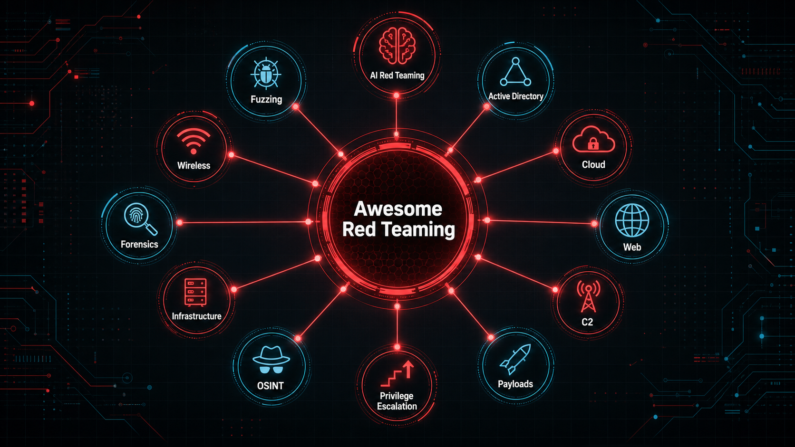

<p align="center">
  
</p>

# Awesome Red Teaming

A curated red-team knowledge base for operators, security researchers, and defenders who need fast navigation across tooling, tradecraft, cloud, identity, web, payload research, AI red teaming, and fuzzing.

> Use only in systems and engagements where you have explicit authorization. The goal of this repository is security testing, research, and defensive validation.

## Quick navigation

- [Full topic index](docs/INDEX.md)
- [Repository spider-web map](docs/graphs/repo-map.md)
- [AI Red Teaming](docs/resources/ai-red-teaming.md)
- [Fuzzing](docs/resources/fuzzing.md)
- [Red Teaming Methodology](docs/resources/methodology.md)

## Core tracks

| Track | Start here |
| --- | --- |
| Identity and Active Directory | [Windows Active Directory Pentest](docs/topics/windows-active-directory-pentest.md), [Active Directory Audit and exploit tools](docs/topics/active-directory-audit-and-exploit-tools.md) |
| Lateral movement and post-exploitation | [Lateral Movement](docs/topics/lateral-movement.md), [POST Exploitation](docs/topics/post-exploitation.md) |
| Web and API testing | [Web Application Pentest](docs/topics/web-application-pentest.md), [REST API Audit](docs/topics/rest-api-audit.md) |
| Privilege escalation | [Windows Privilege Escalation / Audit](docs/topics/windows-privilege-escalation-audit.md), [Linux Privilege Escalation / Audit](docs/topics/linux-privilege-escalation-audit.md) |
| Payloads and evasion | [Payload Generation / AV-Evasion / Malware Creation](docs/topics/payload-generation-av-evasion-malware-creation.md), [EDR Evasion - Logging Evasion](docs/topics/edr-evasion-logging-evasion.md) |
| Cloud | [Azure Red Team Master and Cheat Sheets](docs/topics/azure-red-team-master-and-cheat-sheets.md), [Cloud attack tools](docs/topics/cloud-attack-tools.md) |
| Command and control | [Command & Control Frameworks](docs/topics/command-and-control-frameworks.md), [Cobalt Strike Stuff](docs/topics/cobalt-strike-stuff.md) |
| Recon and external testing | [External Penetration Testing](docs/topics/external-penetration-testing.md), [Domain Finding / Subdomain Enumeration](docs/topics/external-penetration-testing.md#domain-finding--subdomain-enumeration) |
| AI systems | [AI Red Teaming](docs/resources/ai-red-teaming.md) |
| Vulnerability research | [Fuzzing](docs/resources/fuzzing.md), [Source Code / Binary Analysis](docs/topics/source-code-binary-analysis.md) |

## What changed

- Split the old single giant README into focused topic files under `docs/topics/`.
- Added a searchable [topic index](docs/INDEX.md).
- Added modern AI red teaming and fuzzing sections.
- Added a visual knowledge-web banner and Mermaid repository map.
- Kept original resource links in topic pages so existing content is preserved while navigation is cleaner.

## Contributing

Pull requests are welcome. Keep entries concise and useful:

```markdown
- [Project name](PROJECT_URL) - one-line reason it belongs here.
```

Preferred additions:

- actively maintained tools, papers, labs, and playbooks;
- resources with clear defensive, research, or authorized-testing value;
- links that include a short description and fit an existing topic page.

## License

See [LICENSE](LICENSE).
