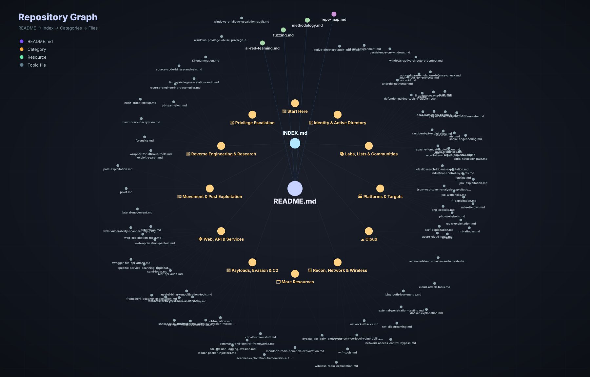

<p align="center">
  
</p>

<h1 align="center">Awesome Red Teaming</h1>

<p align="center">
  <b>A curated map for red-team operators, security researchers, and defenders.</b><br>
  Identity, web, cloud, payload research, C2, AI red teaming, fuzzing, reverse engineering, and practical labs.
</p>

<p align="center">
  <a href="docs/INDEX.md">Table of Contents</a> ·
  <a href="docs/resources/methodology.md">Methodology</a> ·
  <a href="docs/resources/ai-red-teaming.md">AI Red Teaming</a> ·
  <a href="docs/resources/fuzzing.md">Fuzzing</a> ·
  <a href="docs/graphs/repo-map.md">Graph Map</a>
</p>

---

## Table of Contents

- [Features](#features)
- [Legal Note](#legal-note)
- [Get Started](#get-started)
- [Core Red Team Tracks](#core-red-team-tracks)
- [AI Red Teaming](docs/resources/ai-red-teaming.md)
- [Fuzzing](docs/resources/fuzzing.md)
- [Repository Graph Map](docs/graphs/repo-map.md)
- [Full Resource Index](docs/INDEX.md)
- [Contributing](#contributing)

## Features

- Focused topic pages for fast browsing.
- Fast navigation for operators who know what they need.
- Modern sections for AI red teaming and fuzzing.
- Link-check workflow to catch dead resources.
- Clean visual front page for GitHub dark mode.

## Legal Note

Use these resources only where you have explicit authorization. Keep scope, written permission, evidence handling, and cleanup requirements clear before testing.

## Get Started

1. Start with the [methodology page](docs/resources/methodology.md) if you are planning an engagement.
2. Jump into the track closest to your objective.
3. Use the [full index](docs/INDEX.md) when you need a specific tool category.
4. Add good resources with a short reason why they belong.

## Core Red Team Tracks

| Area | Primary resources |
| --- | --- |
| Identity & Active Directory | [Windows AD Pentest](docs/topics/windows-active-directory-pentest.md), [AD Audit & Exploit Tools](docs/topics/active-directory-audit-and-exploit-tools.md) |
| Lateral Movement | [Lateral Movement](docs/topics/lateral-movement.md), [Post Exploitation](docs/topics/post-exploitation.md) |
| Web & API | [Web Application Pentest](docs/topics/web-application-pentest.md), [REST API Audit](docs/topics/rest-api-audit.md) |
| Privilege Escalation | [Windows PrivEsc](docs/topics/windows-privilege-escalation-audit.md), [Linux PrivEsc](docs/topics/linux-privilege-escalation-audit.md) |
| Payloads & Evasion | [Payloads / AV Evasion](docs/topics/payload-generation-av-evasion-malware-creation.md), [EDR Evasion](docs/topics/edr-evasion-logging-evasion.md) |
| Cloud | [Azure Red Team Master](docs/topics/azure-red-team-master-and-cheat-sheets.md), [Cloud Attack Tools](docs/topics/cloud-attack-tools.md) |
| Command & Control | [C2 Frameworks](docs/topics/command-and-control-frameworks.md), [Cobalt Strike](docs/topics/cobalt-strike-stuff.md) |
| Recon | [External Pentest](docs/topics/external-penetration-testing.md), [Network Scanning](docs/topics/network-service-level-vulnerability-scanner.md) |
| AI Systems | [AI Red Teaming](docs/resources/ai-red-teaming.md) |
| Vulnerability Research | [Fuzzing](docs/resources/fuzzing.md), [Source/Binary Analysis](docs/topics/source-code-binary-analysis.md) |

## Contributing

Keep entries clean and useful:

```markdown
- [Project name](PROJECT_URL) - short reason it belongs here.
```

Good additions are active tools, practical labs, research writeups, defensive validation references, and well-maintained cheat sheets.

## Contact Me

<p align="center">
  <a href="https://awesome.re"></a>
  <a href="https://x.com/_MrNiko"></a>
</p>

## License

See [LICENSE](LICENSE).
