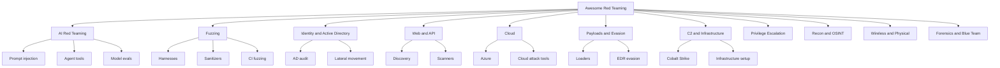

# Repository Map

[← Home](../../README.md) · [Topic index](../INDEX.md)

```mermaid
graph TD
    A[Awesome Red Teaming]
    A --> B[AI Red Teaming]
    A --> C[Fuzzing]
    A --> D[Identity and Active Directory]
    A --> E[Web and API]
    A --> F[Cloud]
    A --> G[Payloads and Evasion]
    A --> H[C2 and Infrastructure]
    A --> I[Privilege Escalation]
    A --> J[Recon and OSINT]
    A --> K[Wireless and Physical]
    A --> L[Forensics and Blue Team]

    B --> B1[Prompt injection]
    B --> B2[Agent tools]
    B --> B3[Model evals]
    C --> C1[Harnesses]
    C --> C2[Sanitizers]
    C --> C3[CI fuzzing]
    D --> D1[AD audit]
    D --> D2[Lateral movement]
    E --> E1[Discovery]
    E --> E2[Scanners]
    F --> F1[Azure]
    F --> F2[Cloud attack tools]
    G --> G1[Loaders]
    G --> G2[EDR evasion]
    H --> H1[Cobalt Strike]
    H --> H2[Infrastructure setup]
```
